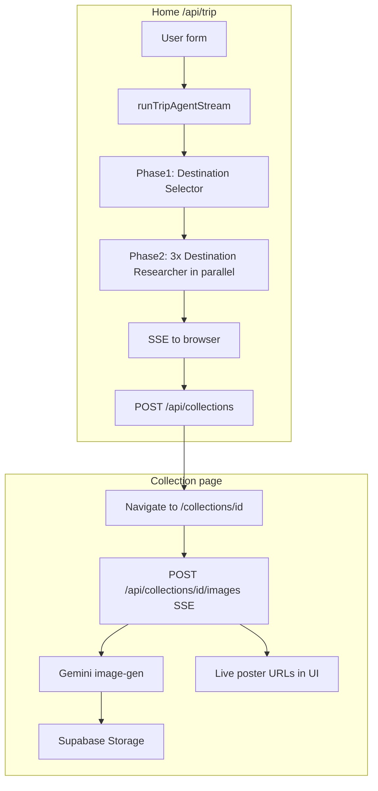

# Wanderlust — Dream Destination Generator

Next.js app where travelers describe their ideal vibe; the **OpenAI Agents SDK** runs a **two-phase pipeline**: a destination shortlist agent, then **three parallel deep-research agents** (one per shortlist slot). Structured results are streamed over **SSE** on the home page, saved to **PostgreSQL (Prisma)** per user, and **travel posters** are generated **asynchronously** after save (Gemini → Supabase Storage) with live updates on the collection page.

## Features

- **Phase 1 — Destination Selector**: geocode + weather tools, structured output for exactly three candidates, **input guardrail**
- **Phase 2 — Parallel research**: `Promise.allSettled` runs **three independent** `destinationResearcherAgent` calls (hosted web search + currency), so research latency is dominated by the slowest slot, not the sum of all three
- **SSE** on `/` (status, tool calls, agent updates, `destination_complete`, final `result`)
- **Dynamic color palette** per destination: AI fills `colorPalette` in structured output; `[app/components/trip-detail.tsx](app/components/trip-detail.tsx)` maps it to CSS variables and a light “content island” so text stays readable on cream or dark AI backgrounds
- **Posters**: not inlined in the trip stream — see [Async poster pipeline](#async-poster-pipeline) below
- **Collections**: Supabase auth + Prisma + optional Storage bucket `trip-images`

## Architecture

### End-to-end flow




### Phase 1 — Destination Selector

Defined in `[lib/trip/agents.ts](lib/trip/agents.ts)`. Uses **geocode** and **weather** tools, `outputType: phase1ResultSchema`, and an **input guardrail** for abusive or invalid trips. Runs with **streaming** so the UI can show tool/agent activity.

### Phase 2 — Three parallel researchers

Implemented in `[lib/trip/agent.ts](lib/trip/agent.ts)` (`runTripAgentStream`):

1. After phase 1 yields three `Phase1Destination` rows, the orchestrator builds one prompt per row and calls `run(destinationResearcherAgent, ...)` **in parallel** via `Promise.allSettled`.
2. Each researcher uses **hosted web search** and **currency** conversion and returns a full `**Destination`** (Zod `destinationSchema`), including nullable `**colorPalette**` for UI theming.
3. Fulfillments are merged in **index order**; if some slots fail, the trip can still succeed with the successful subset (unless validation requires a minimum).

This is **not** a single agent doing three destinations sequentially — it is **three agent runs** in parallel.

### Async poster pipeline

Trip generation **does not** block on images:

1. `[POST /api/trip](app/api/trip/route.ts)` runs `runTripAgentStream` only. Destinations in the stream have `imageUrl: null` (the researcher is instructed to leave images for a separate step).
2. The client saves the trip with `[POST /api/collections](app/api/collections/route.ts)`, then navigates to `/collections/[id]`.
3. `[app/collections/[id]/collection-view.tsx](app/collections/[id]/collection-view.tsx)` calls `[POST /api/collections/[id]/images](app/api/collections/[id]/images/route.ts)`, which streams `[generateCollectionImagesStream](lib/trip/agent.ts)`:
  - For each destination still missing `imageUrl`, `**generateTripImage`** (`[lib/trip/tools/image-gen.ts](lib/trip/tools/image-gen.ts)`) calls **Gemini** (`gemini-3.1-flash-image-preview`).
  - Base64 results are uploaded to **Supabase Storage**; **public HTTPS URLs** are written to `CollectionDestination.imageUrl` and emitted as SSE `image_complete` events.

So: **content first**, **posters second**, with **SSE** driving the carousel without a full page refresh (the image effect is wired so updating React state does not abort the stream mid-flight).

### Colour palette theming

- **Source**: `colorPalette` on each `Destination` (hex fields: `primary`, `secondary`, `accent`, `background`, `text`), produced by the researcher agent with prompt rules to avoid generic cream-only palettes and to keep **text** contrast against **background**.
- **Application**: Scoped to the **destination detail** view after “Explore” (not the global marketing chrome). `[trip-detail.tsx](app/components/trip-detail.tsx)` resolves/falls back hex, sets CSS custom properties, and overrides semantic text tokens when needed so **dark-mode app shell** does not force white text on a light AI background.

## Setup

1. **Install**
  ```bash
   pnpm install
  ```
2. **Environment** — copy `[.env.example](.env.example)` to `.env.local` (or `.env`) and fill values:

  | Variable                                                    | Purpose                                                                         |
  | ----------------------------------------------------------- | ------------------------------------------------------------------------------- |
  | `OPENAI_API_KEY`                                            | OpenAI (Agents SDK + hosted web search)                                         |
  | `GEMINI_API_KEY`                                            | Google GenAI — **images only**                                                  |
  | `NEXT_PUBLIC_SUPABASE_URL`, `NEXT_PUBLIC_SUPABASE_ANON_KEY` | Auth + Storage client                                                           |
  | `DATABASE_URL`                                              | Prisma PostgreSQL URL (pooler ok for runtime)                                   |
  | `DIRECT_URL`                                                | Prisma migrations (often direct/non-pooler URL)                                 |
  | `ALLOW_TRIP_DEBUG`                                          | `true` to enable `/trip/debug` and debug APIs (still requires sign-in)          |
  | `OPENAI_TRIP_MAX_TURNS`                                     | Optional; per-run turn ceiling (see `.env.example`)                             |
  | `OPENAI_TRIP_MODEL_FAST` / `OPENAI_TRIP_MODEL`              | Optional; override default models in `[lib/trip/agents.ts](lib/trip/agents.ts)` |

3. **Database**
  ```bash
   pnpm exec prisma migrate deploy
  ```
4. **Supabase Storage** — create a **public** bucket named `trip-images` (see `[lib/supabase/upload-image.ts](lib/supabase/upload-image.ts)`).
5. **Dev**
  ```bash
   pnpm dev
  ```

## Testing

The brief asked for **JSON parsing/validation** and **component** tests. This repo uses **Jest** + **Testing Library** (`[jest.config.ts](jest.config.ts)`).

```bash
pnpm test
```

Notable suites:


| Area                            | Path                                                                                     |
| ------------------------------- | ---------------------------------------------------------------------------------------- |
| `extractJSON`, schemas          | `[__tests__/lib/trip/schema.test.ts](__tests__/lib/trip/schema.test.ts)`                 |
| Trip form / loading / detail UI | `[__tests__/components/](__tests__/components/)`                                         |
| SDK tool wiring                 | `[__tests__/lib/trip/sdk-tools.test.ts](__tests__/lib/trip/sdk-tools.test.ts)`           |
| Debug sanitization              | `[__tests__/lib/trip/debug-sanitize.test.ts](__tests__/lib/trip/debug-sanitize.test.ts)` |


**Live Open-Meteo** tests are opt-in (CI-friendly):

```bash
RUN_WEATHER_LIVE=1 pnpm test
```

```bash
pnpm weather:smoke
```

## Deployment (Vercel / production)

If the live app shows **“Trip generated but failed to save”** but local dev works, typical causes are:

- `**DATABASE_URL` / `DIRECT_URL`** missing or pointing at a DB that Vercel cannot reach (firewall, wrong region, pooled vs direct URL for Prisma).
- **Migrations not applied** on the production database (`prisma migrate deploy` in CI or release step).
- **Supabase RLS / API** misconfiguration for the server-side Prisma user or service role if you use separate policies.
- **Storage**: bucket `trip-images` missing or not public — posters fail later, but collection **save** should still succeed if only Storage is wrong.

The client **retries** collection save once and surfaces server error text when available (`[app/page.tsx](app/page.tsx)`).

## Tech stack

- Next.js 16 (App Router), React 19, TypeScript, Tailwind 4
- `@openai/agents` + `openai` (structured tools, streaming, guardrails)
- `@google/genai` for image generation only
- Prisma 7 + `@prisma/adapter-pg`, Supabase SSR auth
- Jest + Testing Library

## Design decisions

- **OpenAI Agents SDK** centralizes tool schemas (Zod), streaming, and guardrails instead of a hand-rolled LLM loop.
- **Hosted web search** replaces a separate search API key; research stays on the same provider family as the LLM.
- **Gemini** retained for **photorealistic travel posters**; the trip agents run on OpenAI, image bytes come from Google.
- **Structured outputs** via `outputType` + `[lib/trip/schema.ts](lib/trip/schema.ts)` keep DB and UI shapes aligned.
- **Parallel phase 2** reduces wall-clock time for three deep-research passes.
- **Decoupled images** keep the trip SSE responsive and avoid huge base64 payloads in the main chat stream; URLs are stored on `CollectionDestination.imageUrl`.

## AI-assisted development (Claude Code, Cursor, MCP, skills)

Honest notes for reviewers:

- **Claude Code / Cursor**: Used heavily for scaffolding the multi-agent migration, SSE wiring, and **colour palette** work — especially tightening researcher prompts for `colorPalette`, fixing **dark-mode vs light AI background** text contrast in `trip-detail`, and **collection poster SSE** so the UI does not abort the image stream when `setCollection` runs after each `image_complete`.
- **Supabase MCP**: Connecting the IDE to the project sped up checking auth, Storage, and DB-related behavior without constantly context-switching to the dashboard.
- **Prisma 7**: Used Cursor/practice aligned with current Prisma 7 + `adapter-pg` patterns to wire the schema and migrations faster than manual doc hopping alone.
- **OpenAI Agents skill / docs**: Referenced upstream Agents SDK guidance for **parallel `run()` usage**, **streaming** event shapes, and **tool** definitions so the orchestrator matches current APIs.

If something above saved time, it was **iteration on prompts and client sync**, not replacing architectural thinking — the pipeline design (two phases, parallel research, async posters) was intentional for latency and UX.


