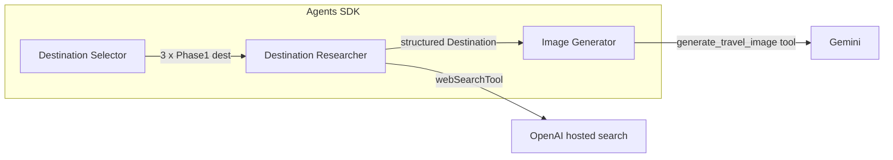

# Wanderlust — Dream Destination Generator

Next.js app where travelers describe their ideal vibe; **OpenAI Agents SDK** orchestrates multiple specialized agents (destination shortlist, deep research, poster images). Results are saved per user (Supabase auth + PostgreSQL/Prisma + Supabase Storage for poster images).

## Features

- Multi-agent pipeline: destination selector → parallel deep research (hosted web search + FX tool) → Gemini image generation as a **function tool**
- **SSE** progress on the home page (tool calls, results, image steps)
- **Dynamic color palette** per destination (CSS variables on detail and card views)
- Saved **collections** with poster images

## Architecture



1. **Destination Selector** (`gpt-4o-mini` by default): `geocode_location`, `get_weather_forecast`, structured output for exactly three candidates. **Input guardrail** blocks abusive or nonsensical requests.
2. **Destination Researcher** (`gpt-4o`): `web_search` (hosted), `convert_currency`, structured `Destination` (including optional `colorPalette` for theming).
3. **Image Generator** (`gpt-4o-mini`): calls `generate_travel_image` → existing `lib/trip/tools/image-gen.ts` (**Gemini** `gemini-3.1-flash-image-preview`).

Override models with `OPENAI_TRIP_MODEL_FAST` and `OPENAI_TRIP_MODEL` if needed.

## Setup

1. **Install**

   ```bash
   pnpm install
   ```

2. **Environment** — copy [`.env.example`](.env.example) to `.env.local` and fill values:

   | Variable | Purpose |
   |----------|---------|
   | `OPENAI_API_KEY` | OpenAI API (Agents SDK + hosted web search) |
   | `GEMINI_API_KEY` | Google GenAI image generation |
   | `NEXT_PUBLIC_SUPABASE_URL`, `NEXT_PUBLIC_SUPABASE_ANON_KEY` | Auth + Storage |
   | `DATABASE_URL` | Prisma/PostgreSQL connection string |
   | `DIRECT_URL` | Prisma migrate datasource (often same as `DATABASE_URL`) |

3. **Database**

   ```bash
   pnpm exec prisma migrate deploy
   ```

4. **Supabase Storage** — create a public bucket named `trip-images` (matches [upload-image.ts](lib/supabase/upload-image.ts)).

5. **Dev**

   ```bash
   pnpm dev
   ```

6. **Tests**

   ```bash
   pnpm test
   ```

## Tech stack

- Next.js 16 (App Router), React 19, TypeScript, Tailwind 4
- **@openai/agents** + **openai** (Responses API / hosted tools)
- **@google/genai** for images only
- Prisma 7 + `@prisma/adapter-pg`, Supabase SSR auth
- Jest + Testing Library for schema and component tests

## Design decisions

- **OpenAI Agents SDK** replaces a hand-rolled Anthropic tool loop: one place for streaming, tool schemas (Zod), and guardrails.
- **Tavily removed**; **hosted `web_search`** reduces keys and aligns search with the same provider as the LLM.
- **Gemini retained for images** (wrapped with `tool()`), per product preference for that model family.
- **Structured outputs** via agent `outputType` + Zod schemas in [lib/trip/schema.ts](lib/trip/schema.ts) keep the UI and DB shape consistent.
- **Deploy/save reliability**: client retries `POST /api/collections` once and surfaces server error text when save fails (common cause of empty `destsArray` or Prisma/RLS issues).

## Time spent

Allow roughly **1 focused day** for the migration, tests, README, and polish (adjust if you track hours differently).

## Claude Code usage (bonus)

If you use **Claude Code** or Cursor agents on this repo: note what worked (e.g. scaffolding agents, tests) and what did not in your own PR/commit message or team notes. No boilerplate here—honest bullets are enough.

## License

Private / assessment project unless otherwise stated.
